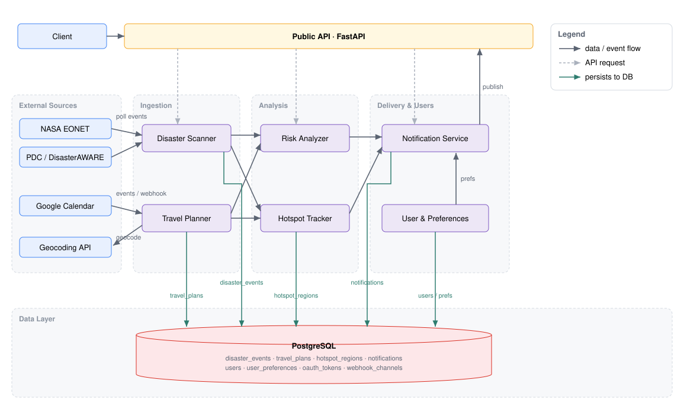
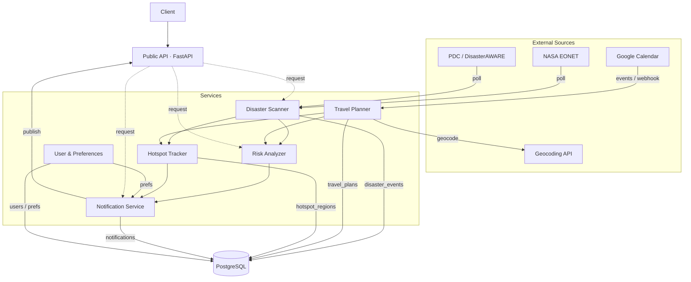

# disaster-adviser

A system that continuously collects disaster data from external sources, collects user
travel plans from Google Calendar, compares both streams using temporal and geospatial
rules, and notifies users when a planned trip may be at risk.

## System Architecture

Layered view: **External Sources** feed the **Services** through the **Ingestion** and
**Analysis** stages, which deliver alerts and persist state to the **Data Layer**.
Arrow types: solid = data / event flow, dashed = API request (facade), teal = persistence
to the database. (Disaster events are also kept in an in-memory cache for fast reads.)

Mermaid source (renders on GitHub)

## Internal Contracts

Modules communicate through standardized internal models, never raw third-party payloads:

| Contract | Meaning |
|----------|---------|
| `StandardDisasterEvent` | Normalized disaster event from NASA or PDC |
| `TravelPlan` | Normalized user trip / calendar event |
| `RiskAssessment` | Result of comparing a travel plan against disaster data |
| `NotificationDecision` | Whether and how the user should be notified |
| `HotspotWarning` | A region flagged as statistically unsafe |
| `UserPreferences` | User settings that influence notification behavior |

## How It Works (Workflow)

The system is built on **Functional Reactive Programming** (`aiostream`). A single
background worker consumes a continuous stream of disaster events and, for each event,
runs the matching logic against all stored travel plans.

### Flow 1 — Disaster-driven (the always-on pipeline)

Started at app startup as a background task (`app/factory.py` → `stream_consumer_worker`).

1. **Fetch** — `fetch_nasa_stream()` / `fetch_pdc_stream()` poll the source APIs on an
   interval and `yield` raw JSON as async iterators (`disaster_scanner/streams.py`).
2. **Merge** — the source streams are merged into one combined stream
   (`stream.merge`, `disaster_scanner/pipeline.py`).
3. **Normalize** — `normalize_router` dispatches each raw payload to the correct pure
   function — `normalize_nasa_event` (takes the latest `geometry` by date) or
   `normalize_pdc_event` (converts the `update_Date` unix timestamp) — producing an
   immutable `StandardDisasterEvent` (`disaster_scanner/core.py`).
4. **Deduplicate** — the `deduplicator` operator drops events whose `id` was already
   seen, keyed on a bounded `seen_keys` set (`disaster_scanner/operators.py`).
5. **Consume & fan out** — for every event the worker (`disaster_scanner/broadcaster.py`):
   - stores it in the in-memory cache (`store_disaster`) for fast `GET /disasters` reads;
   - **upserts** it into the `disaster_events` table (`disaster_event_crud.upsert_disaster_event`);
   - **refreshes hotspots** — `refresh_hotspot_regions` recomputes regional stats from
     recent events and replaces the `hotspot_regions` snapshot;
   - **processes notifications** — `process_disaster_notifications` loads every travel
     plan and evaluates risk (below).
6. **Match & notify** — for each travel plan, `assess_risk` checks temporal overlap and
   geographic proximity → `make_notification_decision` decides if an alert is warranted →
   the notification is persisted (`upsert_notification`) and marked published
   (`mark_published`), which delivers it via the notifications API.

> **In short:** *a disaster appears → is normalized & deduped → stored → matched against
> every trip → users with affected trips are alerted.*

### Flow 2 — Travel-driven

1. The user connects **Google Calendar** through the User & Preferences module.
2. The **Travel Planner** reads calendar events (periodic sync or webhook), extracts
   title/time/location, and **geocodes** textual locations into coordinates.
3. The event becomes a `TravelPlan` and is stored.
4. This triggers the **Risk Analyzer** against currently active disasters and the
   **Hotspot Tracker** against the destination region.
5. If a risk or unsafe-region condition is found, the **Notification Service** sends an
   alert (subject to `UserPreferences`).

> **In short:** *a new trip appears → is geocoded & stored → checked against current and
> regional disaster risk → user is warned if needed.*

### Flow 3 — Manual check (on demand)

1. A client calls the **Public API** to evaluate a trip directly.
2. The request is routed to the **Risk Analyzer** (+ **Hotspot Tracker**), converting the
   trip to a `TravelPlan` first if it is new.
3. The response returns matched nearby disasters, the calculated risk score, and a
   hotspot warning if applicable — without waiting for the background cycle.

### Why the two communication styles

- **Synchronous** calls are used when an immediate result is required — e.g. the Public
  API querying a module, the Notification Service reading `UserPreferences`, or the
  Travel Planner calling the geocoding service.
- **Event-driven** communication decouples producers from consumers: the Disaster Scanner
  does not call the Notification Service directly — it emits updated events, the Risk
  Analyzer reacts, and only a resulting `NotificationDecision` reaches the Notification
  Service. This keeps each module dependent only on the contracts it consumes and
  produces.
